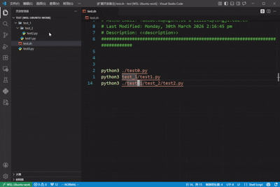

# Goto Files

[English Documentation](./README.md)

VSCode 扩展：支持在 Shell 脚本和批处理文件中通过 Ctrl+左键或 F12 直接打开文件路径。

## 功能演示

## 功能

- **Ctrl+左键点击**：点击文件路径直接打开对应文件
- **F12 转到定义**：光标放在路径上按 F12 跳转
- 支持文件类型：Shell 脚本 (`.sh`) 和批处理文件 (`.bat`, `.cmd`)
- 支持路径类型：
  - 绝对路径：`/etc/hosts`
  - Windows 绝对路径：`C:\Users\test\file.txt`
  - 家目录路径：`~/scripts/my.sh`
  - 相对路径：`./script.sh`、`../config.conf`
  - 无前缀相对路径：`test_1/test1.py`
  - Windows 相对路径：`.\script.bat`、`..\config.ini`
  - Windows 无前缀相对路径：`subdir\file.txt`
  - 环境变量路径：`%USERPROFILE%\file.txt`

支持带引号的 BAT 路径，例如 `copy "C:\My Documents\file.txt" backup.txt`。
不支持未加引号且包含空格的 Windows 路径，例如 `C:\Program Files\app.exe`。

## 说明

- 链接采用懒解析，目标文件不存在时不会打开。
- 相对路径会优先相对于当前文件目录解析，其次回退到工作区根目录。
- 当前版本有意不支持 UNC 路径，例如 `\\server\share`。

## 安装

在 VSCode 插件市场中搜索 `goto files` 并安装。

## 许可证

MIT
